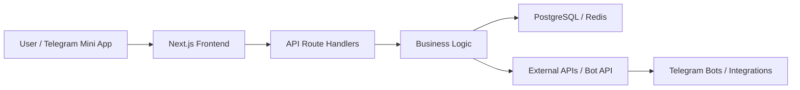

<h1 align="left">rollce</h1>

  <code>Backend & Web Engineer</code> |
  <code>Telegram Bots & Mini Apps</code> |
  <code>AI Automation Builder</code>

I build backend systems, Telegram bots and mini apps, AI automations, and practical web products from idea to production deployment.

  
  
  

---

## Services I Provide

- Backend API Development: architecture and implementation of reliable REST services, auth flows, integrations, and production-ready business logic.
- Telegram Bot Development: bots for support, notifications, moderation, CRM flows, and business operations.
- Telegram Mini Apps: full web interfaces inside Telegram with secure backend integration.
- AI Automations: assistants and workflow automations for repetitive business tasks.
- Web Application Development: modern web apps from architecture to deployment (`Next.js`, `React`, `TypeScript`).

## Case Studies

| Case | Problem | My Solution | Current Outcome |
|---|---|---|---|
| Campus Track | Student teams lose deadlines and task ownership | Multi-page project and task platform with status transitions and analytics | Deployed MVP with API routes and real workflow structure |
| Essay Insight AI | Essay feedback is slow and unclear | Explainable scoring pipeline with readability, structure, and coherence metrics | Live analysis product with methodology page and scoring API |
| QueueCare Navigator | Patients choose wrong queues and waste time | Triage scoring + clinic recommendation engine based on urgency and wait thresholds | Live healthcare routing prototype with clear decision logic |

## Portfolio Suite (13 Distinct Products)

All 13 services are deployed under one Railway ecosystem and represented by dedicated repositories.

| Project | Problem Solved | Repo | Live |
|---|---|---|---|
| Open Data Lab | Open data is hard to understand for non-experts | [Repo](https://github.com/rollce/open-data-lab) | [Live](https://data.rollsev.work) |
| Campus Track | Student teams lose control over deadlines and task ownership | [Repo](https://github.com/rollce/campus-track) | [Live](https://track.rollsev.work) |
| Essay Insight AI | Essay feedback is slow and non-transparent | [Repo](https://github.com/rollce/essay-insight-ai) | [Live](https://essay.rollsev.work) |
| RentWise Splitter | Roommates argue over shared expenses | [Repo](https://github.com/rollce/rentwise-splitter) | [Live](https://rent.rollsev.work) |
| QueueCare Navigator | Patients waste time in wrong clinic queues | [Repo](https://github.com/rollce/queuecare-navigator) | [Live](https://queue.rollsev.work) |
| SafePath Campus | Students need safer night movement planning | [Repo](https://github.com/rollce/safepath-campus) | [Live](https://safe.rollsev.work) |
| FoodLoop Home | Households waste food due to poor pantry visibility | [Repo](https://github.com/rollce/foodloop-home) | [Live](https://food.rollsev.work) |
| SkillBridge Local | Communities fail to match volunteers to needs quickly | [Repo](https://github.com/rollce/skillbridge-local) | [Live](https://skill.rollsev.work) |
| parsingfreelans | Freelance exchange automation with Telegram control, lead scoring, and diagnostics | [Repo](https://github.com/rollce/parsingfreelans) | Internal PoC |
| DialogSpyBot | Telegram Business archive system with web dossier (`Go`, `PostgreSQL`, `Docker`) | [Repo](https://github.com/rollce/DialogSpyBot) | — |
| fragmentsender | API automation for Fragment Stars/Premium operations (`Python`, `FastAPI`, `aiohttp`) | [Repo](https://github.com/rollce/fragmentsender) | — |
| ton-price-bot | Telegram market bot with charted price updates (`Python`, `aiogram`, `matplotlib`) | [Repo](https://github.com/rollce/ton-price-bot) | — |
| rollsev-work | Main personal website with unique visitors counter and production domain setup | [Repo](https://github.com/rollce/rollsev-work) | [Live](https://rollsev.work) |

## Core Expertise

### Backend Focus
- API architecture and route design
- Data modeling and validation
- Redis/PostgreSQL integration patterns
- Webhooks and external service integrations
- Production deployment with Railway

### Telegram Expertise
- Telegram Bot API flows
- Telegram Mini App architecture
- Bot-driven automation and alerting
- Multi-step conversational UX for business tasks

### AI Automation Use Cases
- Automatic text analysis and classification
- Workflow assistants for repetitive operations
- Decision support pipelines for support and ops teams

### Web Development
- Product-oriented frontend architecture
- Multi-page application structure (App Router)
- Practical UI systems for clear user workflows

## System Design Approach

## Reliability & Delivery

- Versioned repositories with reproducible local setup
- Validation and defensive checks on API routes
- Clear environment-driven configuration
- CI-ready workflow and production deployment discipline
- Domain-based public access for portfolio review

## Profile Versions

- University-focused profile: [README.university.md](https://github.com/rollce/rollce/blob/main/README.university.md)
- Client-focused profile: [README.clients.md](https://github.com/rollce/rollce/blob/main/README.clients.md)

## Roadmap (Now)

- Build a production service for sourcing and delivery workflows from China.
- Expand Telegram Mini App portfolio with stronger business cases.
- Add stronger measurable outcomes to portfolio case studies.

## Contact

Open to internships, collaborations, and product engineering partnerships.

- Telegram: [@rollsev](https://t.me/rollsev)
- GitHub: [rollce](https://github.com/rollce)

## Contribution Activity

<picture>
  <source media="(prefers-color-scheme: dark)" srcset="https://raw.githubusercontent.com/rollce/rollce/output/github-contribution-grid-snake-dark.svg" />
  <source media="(prefers-color-scheme: light)" srcset="https://raw.githubusercontent.com/rollce/rollce/output/github-contribution-grid-snake.svg" />
  
</picture>
